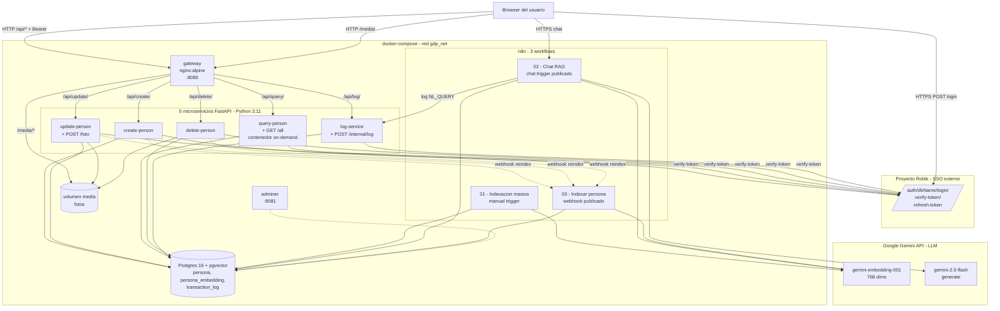
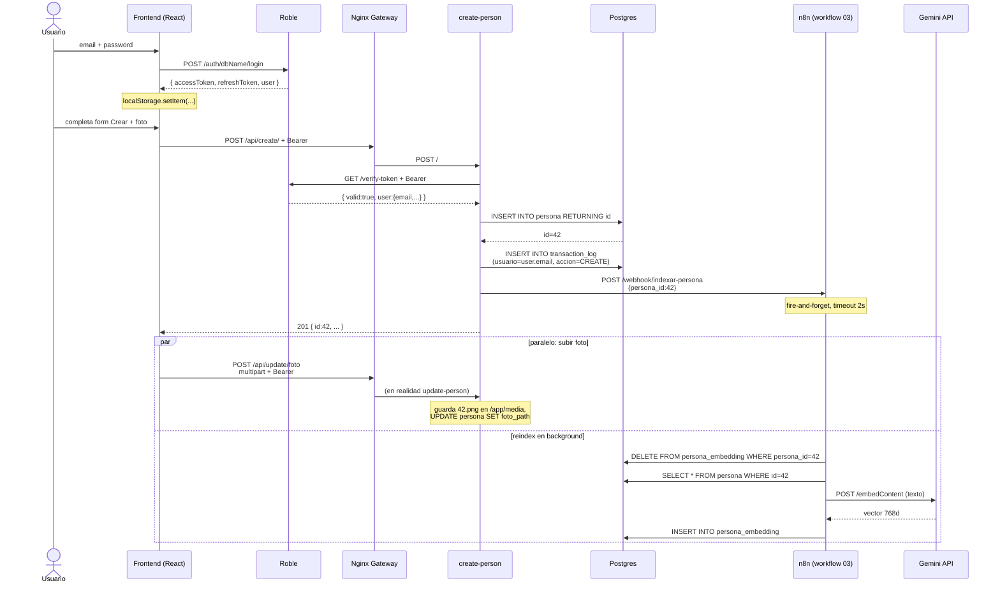
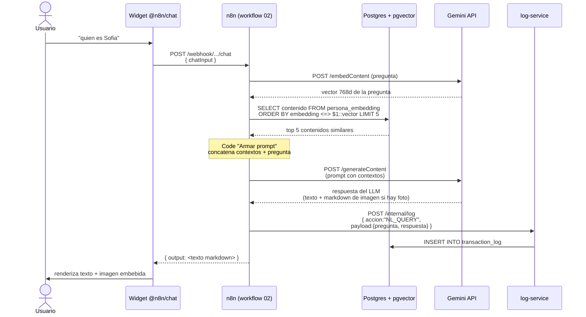
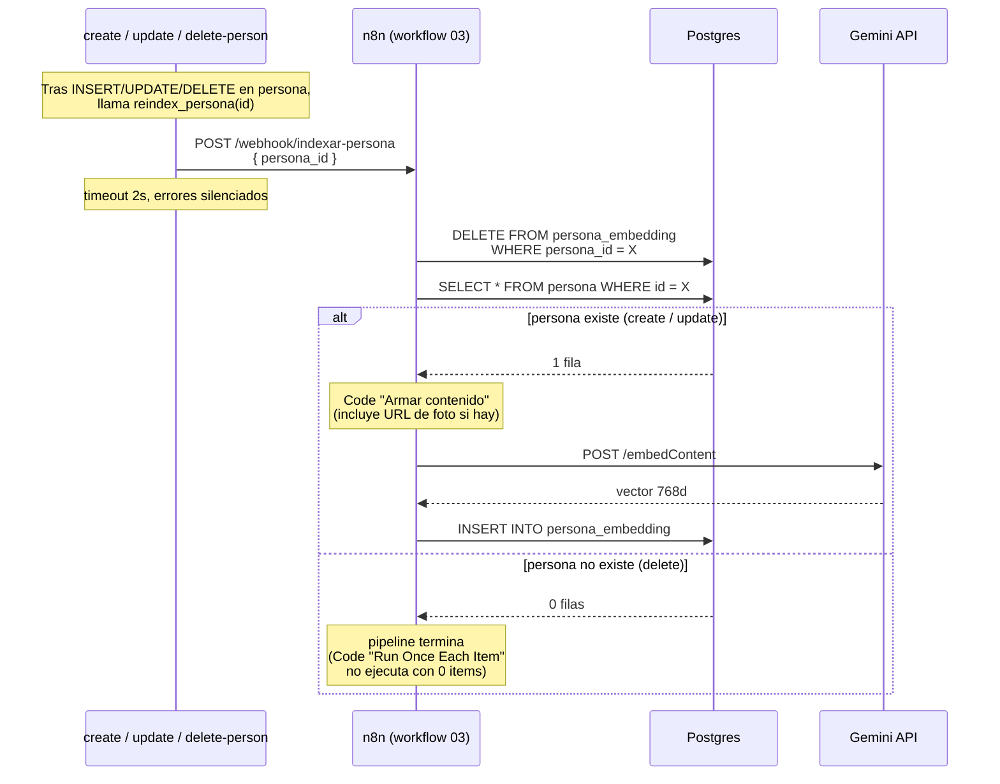

# Arquitectura

Diagramas en [Mermaid](https://mermaid.js.org/). GitHub los renderiza al abrir este archivo.

## 1. Vista de contenedores

Topología del stack (todo corre con `docker compose up -d`).

**Notas**:

- El usuario hace login contra Roble **directamente** (CORS abierto). El frontend nunca proxea credenciales.
- Cada request a `/api/*` viaja con `Authorization: Bearer <accessToken>`. Cada microservicio valida llamando a `verify-token` de Roble. Si el token expira, el frontend renueva con el `refreshToken` automáticamente.
- `query-person` es el único microservicio "apagable on-demand" según el enunciado: `make stop-query` lo detiene; el resto sigue funcionando.
- Las fotos se guardan en un **volumen Docker** compartido entre los microservicios (read-write) y Nginx (read-only). Nginx las sirve en `/media/<persona_id>.<ext>`.

---

## 2. Login + CRUD (crear persona)

**Lo que importa**:

- El backend **delega** la validación de identidad a Roble — no decodifica JWTs por sí mismo, no comparte secrets.
- El log queda con el email **real** del usuario autenticado (`test@uninorte.edu.co`, no un mock).
- El reindex es **fire-and-forget**: si n8n está caído, el CRUD igual responde 201. La consistencia eventual del RAG no bloquea el camino crítico.

---

## 3. Chat en lenguaje natural (RAG)

**Por qué pgvector y no llamar al LLM con TODA la base**:

- Escalabilidad: con 1000 personas, mandarle todas al LLM es 100KB+ por request. Con top-K=5 mandamos sólo los 5 más relevantes.
- Costo: cada token cuesta. Top-K reduce drásticamente.
- Calidad: el LLM se enfoca en lo relevante, no se distrae con datos irrelevantes.

---

## 4. Re-indexación automática (webhook)

**Idempotencia**: el workflow 3 hace siempre `DELETE` antes de `INSERT`. Si lo invocás 5 veces seguidas para el mismo `persona_id`, el resultado es el mismo. Eso lo hace robusto frente a reintentos o webhooks duplicados.

**Falla del webhook**: el helper `common/reindex.py` **swallow errores**. Si n8n está caído cuando se crea una persona, la persona queda en `persona` pero no en `persona_embedding`. Para corregir, basta correr el **workflow 1** manualmente — limpia y re-genera todo. Es el plan B documentado.
